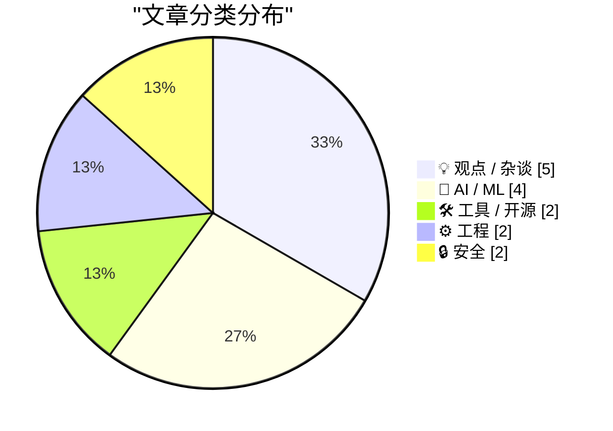
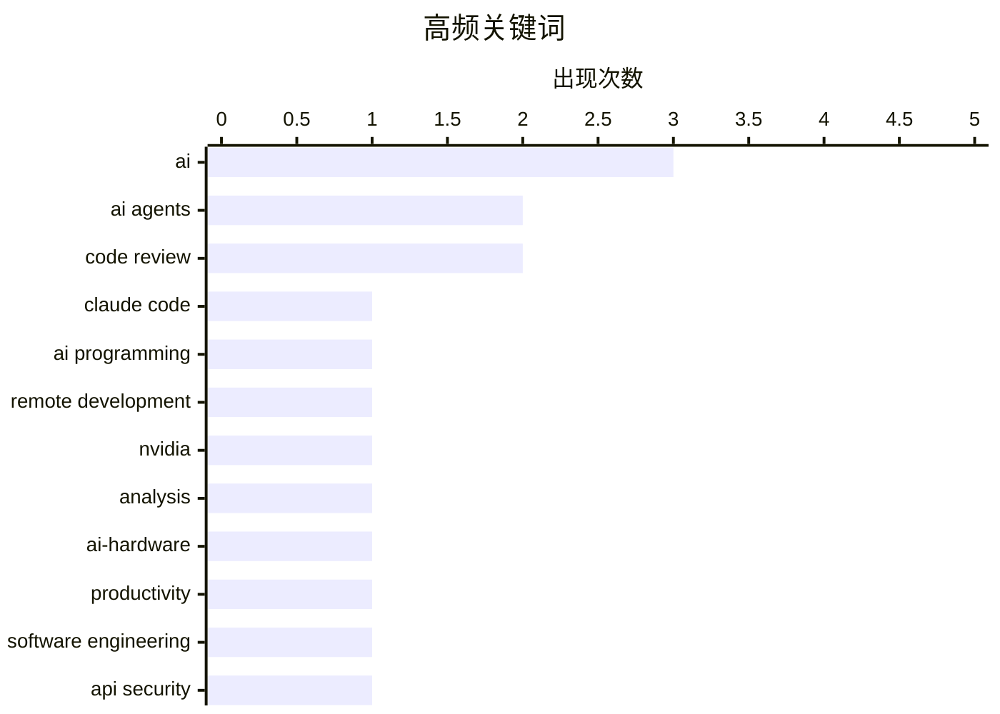

# 📰 AI 博客每日精选 — 2026-02-27

> 来自 Karpathy 推荐的 92 个顶级技术博客，AI 精选 Top 15

## 📝 今日看点

今日技术圈在狂热与反思中前行。一方面，AI编程助手与智能体工程模式正重塑开发流程，从“氛围编程”到自动化代码审查，效率提升工具备受关注。另一方面，行业对AI炒作与安全隐忧展开深度批判，警惕技术叙事脱离现实，并警示API密钥管理等新兴风险。同时，关于技术泡沫的讨论再次升温，提醒人们以史为鉴，冷静审视当前浪潮。

---

## 🏆 今日必读

🥇 **Claude Code 远程控制功能**

[Claude Code Remote Control](https://simonwillison.net/2026/Feb/25/claude-code-remote-control/#atom-everything) — simonwillison.net · 1 天前 · 🛠 工具 / 开源

> Claude Code 新推出了远程控制功能，允许用户在本地计算机上运行一个会话，然后通过网页、iOS 或原生桌面应用界面向其发送提示词。该功能目前仍存在一些不稳定性，部分用户（如作者本人）在尝试时遇到了“您的账户未启用远程控制”的错误提示。这标志着 Claude 正试图将 AI 编程助手的交互从纯聊天界面，扩展到更贴近开发者本地工作流的深度集成模式。

💡 **为什么值得读**: 了解 Claude 如何通过远程控制功能，将 AI 编程助手更深地融入本地开发环境，是评估其未来工作流潜力的关键。

🏷️ Claude Code, AI Programming, Remote Development

🥈 **论英伟达与分析废话**

[On NVIDIA and Analyslop](https://www.wheresyoured.at/on-nvidia-and-analyslop/) — wheresyoured.at · 8 小时前 · 🤖 AI / ML

> 文章批判了科技行业，尤其是围绕英伟达（NVIDIA）的过度炒作和分析师言论中的空话（Analyslop）。作者指出，市场对英伟达的狂热叙事常常脱离其技术和商业现实，充斥着未来主义的幻想而非基于事实的严谨分析。这种氛围导致投资者和公众难以做出理性判断，并掩盖了公司可能面临的实际挑战。

💡 **为什么值得读**: 本文提供了一个对当前科技炒作文化的犀利批判视角，有助于在狂热的市场情绪中保持清醒。

🏷️ NVIDIA, analysis, AI-hardware

🥉 **囤积你掌握的方法**

[Hoard things you know how to do](https://simonwillison.net/guides/agentic-engineering-patterns/hoard-things-you-know-how-to-do/#atom-everything) — simonwillison.net · 4 小时前 · ⚙️ 工程

> 这是“智能体工程模式”系列中的一条核心建议：系统地积累你已知如何完成的任务和方法。构建软件的关键技能在于清楚知道什么是可行的、什么是不可行的，并对如何实现有大致思路。将这些“已知方法”记录下来（如代码片段、配置示例、命令），能极大提升你与编码智能体的协作效率。这本质上是将个人经验转化为可被智能体理解和复用的知识库。

💡 **为什么值得读**: 这条实践性极强的建议，揭示了如何将个人经验系统化，以最大化 AI 编程助手的效用。

🏷️ AI Agents, Productivity, Software Engineering

---

## 📊 数据概览

| 扫描源 | 抓取文章 | 时间范围 | 精选 |
|:---:|:---:|:---:|:---:|
| 87/92 | 2463 篇 → 55 篇 | 48h | **15 篇** |

### 分类分布



### 高频关键词



<details>
<summary>📈 纯文本关键词图（终端友好）</summary>

```
ai                 │ ████████████████████ 3
ai agents          │ █████████████░░░░░░░ 2
code review        │ █████████████░░░░░░░ 2
claude code        │ ███████░░░░░░░░░░░░░ 1
ai programming     │ ███████░░░░░░░░░░░░░ 1
remote development │ ███████░░░░░░░░░░░░░ 1
nvidia             │ ███████░░░░░░░░░░░░░ 1
analysis           │ ███████░░░░░░░░░░░░░ 1
ai-hardware        │ ███████░░░░░░░░░░░░░ 1
productivity       │ ███████░░░░░░░░░░░░░ 1
```

</details>

### 🏷️ 话题标签

**ai**(3) · **ai agents**(2) · **code review**(2) · claude code(1) · ai programming(1) · remote development(1) · nvidia(1) · analysis(1) · ai-hardware(1) · productivity(1) · software engineering(1) · api security(1) · google gemini(1) · vulnerability(1) · llm(1) · ai tools(1) · presentation(1) · documentation(1) · hype cycle(1) · technology trends(1)

---

## 💡 观点 / 杂谈

### 1. 这次不一样

[This time is different](https://shkspr.mobi/blog/2026/02/this-time-is-different/) — **shkspr.mobi** · 12 小时前 · ⭐ 24/30

> 文章列举了 3D 电视、元宇宙、NFT 等众多曾被狂热炒作但最终未达预期的技术浪潮。作者指出，如今对人工智能（AI）的狂热鼓吹者，与过去追捧那些“废话”的往往是同一批人。其核心观点在于，对任何宣称“这次不一样”的技术革命都应保持高度怀疑，历史表明过度炒作是常态而非例外。

🏷️ hype cycle, technology trends, critical thinking

---

### 2. 探讨科技清算

[Talking through the tech reckoning](https://anildash.com/2026/02/25/talking-through-the-tech-reckoning/) — **anildash.com** · 1 天前 · ⭐ 24/30

> 作者认为当前关于技术的讨论比以往任何时候都更重要，且风险更高。为了传播那些可能被传统科技声音忽视的观点，他正积极参与更多公共对话。文中提到了他参与的“Galaxy Brain”等对话节目，这些内容受到了良好反响。其核心是呼吁在科技发展的关键节点，进行更广泛、更多元化的反思与讨论。

🏷️ tech industry, ethics, society

---

### 3. 引用安德烈·卡帕西的观点

[Quoting Andrej Karpathy](https://simonwillison.net/2026/Feb/26/andrej-karpathy/#atom-everything) — **simonwillison.net** · 5 小时前 · ⭐ 23/30

> AI编程在过去两个月，尤其是去年12月，发生了根本性而非渐进式的变革。编程智能体在12月前基本不可用，之后则变得基本可用，关键在于模型质量、长期连贯性和持久性实现了显著跃升。这些新型AI编码助手能够坚持不懈地处理大型复杂任务，标志着开发工作流程的范式转变。这预示着软件开发的生产力与协作模式将进入一个新时代。

🏷️ Programming, AI, Future of Work

---

### 4. 一切都很棒（我为何是个乐观主义者）

[Everything is awesome (why I'm an optimist)](https://www.joanwestenberg.com/everything-is-awesome-why-im-an-optimist/) — **joanwestenberg.com** · 1 天前 · ⭐ 23/30

> 针对二月份以来互联网上弥漫的、类似早期新冠恐慌的AI末日论调（如某文章获超8000万浏览量），作者提出了鲜明的乐观主义反驳。文章认为，当前对AI威胁的恐慌性叙事被过度放大，忽视了技术带来的巨大积极潜力。作者通过列举事实或论点，论证了AI在解决问题、促进繁荣方面的关键作用。其核心观点是，我们应避免被恐惧支配，而是以建设性态度引导AI向善。

🏷️ AI, optimism, future

---

### 5. 引用凯兰·埃利奥特-麦克雷的观点

[Quoting Kellan Elliott-McCrea](https://simonwillison.net/2026/Feb/25/kellan-elliott-mccrea/#atom-everything) — **simonwillison.net** · 1 天前 · ⭐ 22/30

> 探讨了AI时代程序员群体中出现的“失落感”存在代际差异。近二十年因工作好或喜欢编码而入行的人，可能因AI编码的兴起感到技能贬值与失落。但对于更早一代因追求“能动性”而进入科技行业的人来说，这种情感难以共鸣，因为他们经历过Web技术简陋但充满创造自由的时代。其深层观点是，代码本身从来不是最难的部分，技术背后的意图、架构与创造过程才是核心价值所在。

🏷️ Technology, Career, AI Impact

---

## 🤖 AI / ML

### 6. 论英伟达与分析废话

[On NVIDIA and Analyslop](https://www.wheresyoured.at/on-nvidia-and-analyslop/) — **wheresyoured.at** · 8 小时前 · ⭐ 25/30

> 文章批判了科技行业，尤其是围绕英伟达（NVIDIA）的过度炒作和分析师言论中的空话（Analyslop）。作者指出，市场对英伟达的狂热叙事常常脱离其技术和商业现实，充斥着未来主义的幻想而非基于事实的严谨分析。这种氛围导致投资者和公众难以做出理性判断，并掩盖了公司可能面临的实际挑战。

🏷️ NVIDIA, analysis, AI-hardware

---

### 7. 我用“氛围编程”了一款梦想中的 macOS 演示应用

[I vibe coded my dream macOS presentation app](https://simonwillison.net/2026/Feb/25/present/#atom-everything) — **simonwillison.net** · 1 天前 · ⭐ 24/30

> 作者在“社交科学 FOO 营地”活动前夜，通过“氛围编程”快速开发了一款自定义的 macOS 演示应用，用于题为“2026年2月 LLM 现状”的演讲。他利用 AI 编程助手，在极短时间内将想法转化为可工作的软件，以配合其非传统的会议演讲风格。这个过程展示了现代开发工具如何赋能个人快速实现高度定制化的创意需求。

🏷️ LLM, AI Tools, Presentation

---

### 8. 美国空军退役上将谈 Anthropic 与五角大楼的紧张关系

[Retired US Air Force General Jack Shanahan on the Anthropic-Pentagon tensions](https://garymarcus.substack.com/p/retired-us-air-force-general-jack) — **garymarcus.substack.com** · 1 小时前 · ⭐ 24/30

> 文章聚焦于美国空军退役上将杰克·沙纳汉对 Anthropic 公司与美国国防部之间紧张关系的评论。沙纳汉将军的核心观点非常明确：以目前的形式，任何大语言模型都不应考虑用于完全致命的自主武器系统。他认为这种提议是荒谬的，强调了在生死攸关的军事应用中部署不成熟 AI 技术的巨大风险。

🏷️ AI ethics, military, autonomous weapons

---

### 9. 达里奥·阿莫代伊的历史性声明

[Historic statement from Dario Amodei](https://garymarcus.substack.com/p/historic-statement-from-dario-amodei) — **garymarcus.substack.com** · 1 小时前 · ⭐ 23/30

> 文章聚焦于Anthropic联合创始人兼CEO达里奥·阿莫代伊就AI安全与发展方向发表的一份重要声明。该声明很可能涉及对AI能力增长、风险管控或治理框架的深刻见解。作为行业领军人物，阿莫代伊的公开表态通常预示着技术路线或政策讨论的关键转向。这份声明被作者视为具有历史意义，可能为理解未来AI监管与发展路径提供核心坐标。

🏷️ AI safety, statement, Anthropic

---

## 🛠 工具 / 开源

### 10. Claude Code 远程控制功能

[Claude Code Remote Control](https://simonwillison.net/2026/Feb/25/claude-code-remote-control/#atom-everything) — **simonwillison.net** · 1 天前 · ⭐ 25/30

> Claude Code 新推出了远程控制功能，允许用户在本地计算机上运行一个会话，然后通过网页、iOS 或原生桌面应用界面向其发送提示词。该功能目前仍存在一些不稳定性，部分用户（如作者本人）在尝试时遇到了“您的账户未启用远程控制”的错误提示。这标志着 Claude 正试图将 AI 编程助手的交互从纯聊天界面，扩展到更贴近开发者本地工作流的深度集成模式。

🏷️ Claude Code, AI Programming, Remote Development

---

### 11. 在 CI/CD 中使用 OpenCode 进行 AI 代码审查

[Using OpenCode in CI/CD for AI pull request reviews](https://martinalderson.com/posts/using-opencode-in-cicd-for-ai-pull-request-reviews/?utm_source=rss) — **martinalderson.com** · 1 天前 · ⭐ 24/30

> 作者分享了用开源工具 OpenCode 替代 SaaS 代码审查工具，并将其集成到 CI/CD 流水线中的经验。这样做的主要优势在于成本更低、安全性更高（代码不出内部环境），并且能够与任何 Git 提供商配合使用。文章提供了具体的实践方案，展示了如何利用本地化部署的 AI 能力来自动化代码审查流程。

🏷️ AI, code review, CI/CD, OpenCode

---

## ⚙️ 工程

### 12. 囤积你掌握的方法

[Hoard things you know how to do](https://simonwillison.net/guides/agentic-engineering-patterns/hoard-things-you-know-how-to-do/#atom-everything) — **simonwillison.net** · 4 小时前 · ⭐ 24/30

> 这是“智能体工程模式”系列中的一条核心建议：系统地积累你已知如何完成的任务和方法。构建软件的关键技能在于清楚知道什么是可行的、什么是不可行的，并对如何实现有大致思路。将这些“已知方法”记录下来（如代码片段、配置示例、命令），能极大提升你与编码智能体的协作效率。这本质上是将个人经验转化为可被智能体理解和复用的知识库。

🏷️ AI Agents, Productivity, Software Engineering

---

### 13. 线性代码走查

[Linear walkthroughs](https://simonwillison.net/guides/agentic-engineering-patterns/linear-walkthroughs/#atom-everything) — **simonwillison.net** · 1 天前 · ⭐ 24/30

> 这是“智能体工程模式”系列中的另一个模式：让编码智能体对代码库进行结构化的线性走查。无论是为了快速理解遗留代码、回顾自己遗忘的代码，还是理清“氛围编程”产出的混乱逻辑，这一方法都很有用。配备合适智能体框架的前沿模型可以构建出代码的思维导图或生成逐部分解释。这相当于为代码库创建了一个即时、互动的导航指南。

🏷️ AI Agents, Code Review, Documentation

---

## 🔒 安全

### 14. 谷歌 API 密钥本非机密，但 Gemini 改变了规则

[Google API Keys Weren't Secrets. But then Gemini Changed the Rules.](https://simonwillison.net/2026/Feb/26/google-api-keys/#atom-everything) — **simonwillison.net** · 20 小时前 · ⭐ 24/30

> 文章揭露了一个严重的安全隐患：Gemini 和 Google Maps 等服务共享同一套 API 密钥体系。Google Maps 的 API 密钥设计为公开，常被直接嵌入网页；而 Gemini 的 API 密钥却可用于访问私有文件和发起计费 API 请求。这种混淆导致大量本应保密的 Gemini 密钥被意外公开，可能造成数据泄露和财务损失。问题的根源在于谷歌未对两类不同安全级别的服务进行密钥隔离。

🏷️ API Security, Google Gemini, Vulnerability

---

### 15. 仅限会员：你的匿名集合已经崩溃，而你尚未察觉

[Members Only: Your anonymity set has collapsed and you don't know it yet](https://www.joanwestenberg.com/members-only-your-anonymity-set-has-collapsed-and-you-dont-know-it-yet/) — **joanwestenberg.com** · 22 小时前 · ⭐ 23/30

> 文章核心是揭示在大数据与算法时代，个人在线匿名性已实质上瓦解。通过数据交叉关联与行为分析，即使不直接使用真实姓名，个体的身份也极易被重新识别。所谓的“匿名集合”在强大的去匿名化技术面前变得非常脆弱。作者警示，公众对于自身隐私暴露的程度普遍存在认知滞后，面临严峻的数字身份安全风险。

🏷️ privacy, anonymity, tracking

---

*生成于 2026-02-27 00:36 | 扫描 87 源 → 获取 2463 篇 → 精选 15 篇*
*基于 [Hacker News Popularity Contest 2025](https://refactoringenglish.com/tools/hn-popularity/) RSS 源列表，由 [Andrej Karpathy](https://x.com/karpathy) 推荐*
*由「懂点儿AI」制作，欢迎关注同名微信公众号获取更多 AI 实用技巧 💡*
