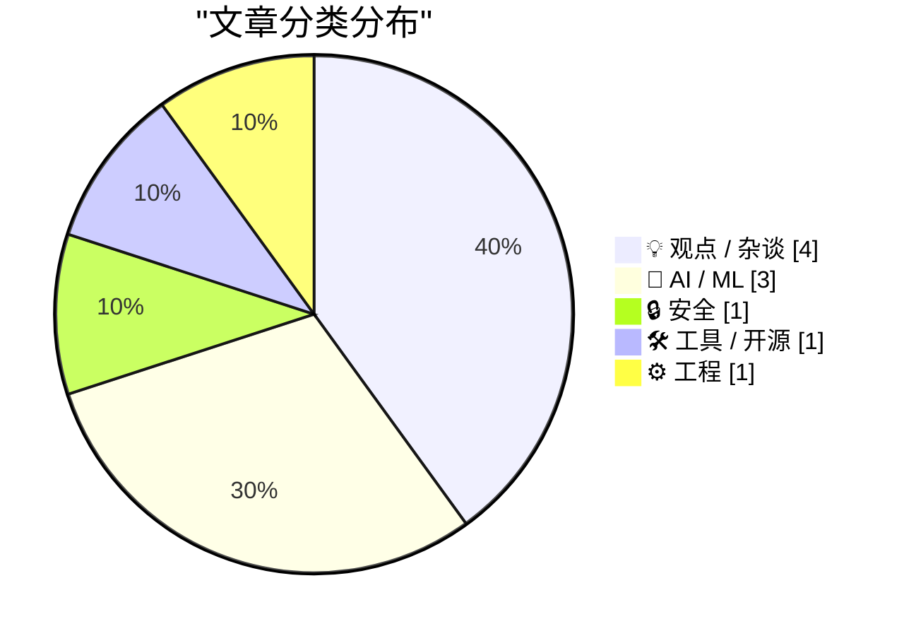
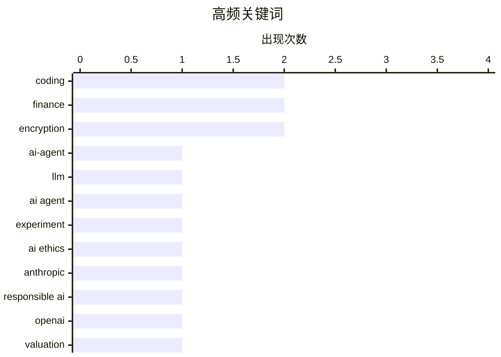

# 📰 AI 博客每日精选 — 2026-02-28

> 来自 Karpathy 推荐的 92 个顶级技术博客，AI 精选 Top 10

## 📝 今日看点

今日技术圈聚焦于AI伦理与商业化的深层博弈，以及安全与隐私的持续拉锯。一方面，AI巨头在军事合作、巨额融资与开源支持上的动向引发行业对技术边界与商业理性的广泛讨论；另一方面，从数据加密到内容审查，技术方案背后的法律与用户风险再次被尖锐提至台前。同时，企业大规模裁员与效率工具的创新，折射出行业在降本增效与技术创新间的现实张力。

---

## 🏆 今日必读

🥇 **一位AI编码代理怀疑论者的详尽AI代理编码实践**

[An AI agent coding skeptic tries AI agent coding, in excessive detail](https://simonwillison.net/2026/Feb/27/ai-agent-coding-in-excessive-detail/#atom-everything) — simonwillison.net · 9 小时前 · 🤖 AI / ML

> 文章记录了作者Max Woolf从怀疑到实践AI编码代理的完整过程。他通过一系列难度递增的项目进行测试，从简单的YouTube元数据抓取工具开始，逐步挑战更复杂的任务。实践表明，自2025年11月以来，AI编码代理的能力取得了显著进步，能够处理相当复杂的开发工作流。作者通过详尽的细节展示了AI代理当前的实际能力与局限性。

💡 **为什么值得读**: 通过一位资深开发者的第一手实践报告，为评估AI编码代理的实用性和成熟度提供了具体、可信的参考。

🏷️ AI-agent, coding, LLM

🥈 **一位AI编码代理怀疑论者的详尽AI代理编码实践**

[An AI agent coding skeptic tries AI agent coding, in excessive detail](https://minimaxir.com/2026/02/ai-agent-coding/) — minimaxir.com · 12 小时前 · 🤖 AI / ML

> 文章记录了作者Max Woolf从怀疑到实践AI编码代理的完整过程。他通过一系列难度递增的项目进行测试，从简单的YouTube元数据抓取工具开始，逐步挑战更复杂的任务。实践表明，自2025年11月以来，AI编码代理的能力取得了显著进步，能够处理相当复杂的开发工作流。作者通过详尽的细节展示了AI代理当前的实际能力与局限性。

💡 **为什么值得读**: 通过一位资深开发者的第一手实践报告，为评估AI编码代理的实用性和成熟度提供了具体、可信的参考。

🏷️ AI agent, coding, experiment

🥉 **给达里奥一块饼干？——Anthropic与死亡交易**

[A Cookie for Dario? — Anthropic and selling death](https://anildash.com/2026/02/27/a-cookie-for-dario/) — anildash.com · 6 小时前 · 💡 观点 / 杂谈

> 文章聚焦于AI公司Anthropic及其CEO Dario Amodei拒绝美国国防部修改Claude模型以支持潜在战争罪行的请求。国防部将请求包装为“合法目的”的技术使用，但因其对近期罪行的“合法化”描述而备受质疑。Anthropic的拒绝凸显了AI伦理与军事应用之间的尖锐冲突。作者批判了将先进AI技术武器化的企图。

💡 **为什么值得读**: 揭示了AI巨头在国家安全压力下所面临的严峻伦理抉择，关乎技术发展的根本方向。

🏷️ AI ethics, Anthropic, responsible AI

---

## 📊 数据概览

| 扫描源 | 抓取文章 | 时间范围 | 精选 |
|:---:|:---:|:---:|:---:|
| 84/92 | 2403 篇 → 22 篇 | 24h | **10 篇** |

### 分类分布



### 高频关键词



<details>
<summary>📈 纯文本关键词图（终端友好）</summary>

```
coding         │ ████████████████████ 2
finance        │ ████████████████████ 2
encryption     │ ████████████████████ 2
ai-agent       │ ██████████░░░░░░░░░░ 1
llm            │ ██████████░░░░░░░░░░ 1
ai agent       │ ██████████░░░░░░░░░░ 1
experiment     │ ██████████░░░░░░░░░░ 1
ai ethics      │ ██████████░░░░░░░░░░ 1
anthropic      │ ██████████░░░░░░░░░░ 1
responsible ai │ ██████████░░░░░░░░░░ 1
```

</details>

### 🏷️ 话题标签

**coding**(2) · **finance**(2) · **encryption**(2) · ai-agent(1) · llm(1) · ai agent(1) · experiment(1) · ai ethics(1) · anthropic(1) · responsible ai(1) · openai(1) · valuation(1) · passkeys(1) · data-loss(1) · privacy(1) · csam(1) · claude(1) · open-source(1) · ai-assistant(1) · private equity(1)

---

## 💡 观点 / 杂谈

### 1. 给达里奥一块饼干？——Anthropic与死亡交易

[A Cookie for Dario? — Anthropic and selling death](https://anildash.com/2026/02/27/a-cookie-for-dario/) — **anildash.com** · 6 小时前 · ⭐ 26/30

> 文章聚焦于AI公司Anthropic及其CEO Dario Amodei拒绝美国国防部修改Claude模型以支持潜在战争罪行的请求。国防部将请求包装为“合法目的”的技术使用，但因其对近期罪行的“合法化”描述而备受质疑。Anthropic的拒绝凸显了AI伦理与军事应用之间的尖锐冲突。作者批判了将先进AI技术武器化的企图。

🏷️ AI ethics, Anthropic, responsible AI

---

### 2. 西弗吉尼亚州的反苹果CSAM诉讼将帮助儿童性侵者逍遥法外

[West Virginia’s Anti-Apple CSAM Lawsuit Would Help Child Predators Walk Free](https://www.techdirt.com/2026/02/25/west-virginias-anti-apple-csam-lawsuit-would-help-child-predators-walk-free/) — **daringfireball.net** · 11 小时前 · ⭐ 24/30

> 文章分析西弗吉尼亚州起诉苹果、要求其扫描iCloud中儿童性虐待材料（CSAM）的潜在法律后果。核心论点是，若法院强制苹果进行扫描，所有被标记的图像都将被视为无搜查令、无合理理由的政府搜查所得证据。根据美国宪法第四修正案的排除规则，辩护律师可以要求法庭排除这些证据并很可能成功。此举反而会破坏对犯罪者的起诉。

🏷️ privacy, CSAM, encryption

---

### 3. 付费内容：私募股权黑粉指南

[Premium: The Hater's Guide to Private Equity](https://www.wheresyoured.at/hatersguide-pe/) — **wheresyoured.at** · 13 小时前 · ⭐ 22/30

> 文章宣称我们正面临一场“全球智力危机”，表现为大量人群正在做出极其愚蠢的行为。作者以Citrini Research发布的拙劣报告《2028全球智力危机》为例，批评其是充满垃圾信息的恐吓小说。本文是本周免费文章的延伸，旨在深入剖析和讽刺当前金融分析领域的低智化现象。

🏷️ private equity, finance, critique

---

### 4. Block公司裁员4000人（占员工总数近一半）

[Block Lays Off 4,000 (of 10,000) Employees](https://www.cnbc.com/2026/02/26/block-laying-off-about-4000-employees-nearly-half-of-its-workforce.html) — **daringfireball.net** · 15 小时前 · ⭐ 21/30

> Block公司宣布裁员超过4000名员工，约占其总人力的一半，员工数量将从超过10000人缩减至6000人以下。此消息导致其股价在盘后交易中飙升高达24%。CEO杰克·多西在致股东信中称这是一个艰难的决定。此次大规模裁员是近期科技行业裁员潮的一部分。

🏷️ layoffs, Block, business

---

## 🤖 AI / ML

### 5. 一位AI编码代理怀疑论者的详尽AI代理编码实践

[An AI agent coding skeptic tries AI agent coding, in excessive detail](https://simonwillison.net/2026/Feb/27/ai-agent-coding-in-excessive-detail/#atom-everything) — **simonwillison.net** · 9 小时前 · ⭐ 28/30

> 文章记录了作者Max Woolf从怀疑到实践AI编码代理的完整过程。他通过一系列难度递增的项目进行测试，从简单的YouTube元数据抓取工具开始，逐步挑战更复杂的任务。实践表明，自2025年11月以来，AI编码代理的能力取得了显著进步，能够处理相当复杂的开发工作流。作者通过详尽的细节展示了AI代理当前的实际能力与局限性。

🏷️ AI-agent, coding, LLM

---

### 6. 一位AI编码代理怀疑论者的详尽AI代理编码实践

[An AI agent coding skeptic tries AI agent coding, in excessive detail](https://minimaxir.com/2026/02/ai-agent-coding/) — **minimaxir.com** · 12 小时前 · ⭐ 27/30

> 文章记录了作者Max Woolf从怀疑到实践AI编码代理的完整过程。他通过一系列难度递增的项目进行测试，从简单的YouTube元数据抓取工具开始，逐步挑战更复杂的任务。实践表明，自2025年11月以来，AI编码代理的能力取得了显著进步，能够处理相当复杂的开发工作流。作者通过详尽的细节展示了AI代理当前的实际能力与局限性。

🏷️ AI agent, coding, experiment

---

### 7. OpenAI的新融资合理吗？

[Does OpenAI’s new financing make sense?](https://garymarcus.substack.com/p/does-openais-new-financing-make-sense) — **garymarcus.substack.com** · 10 小时前 · ⭐ 25/30

> 文章对OpenAI新一轮融资的合理性提出根本性质疑。作者Gary Marcus并非唯一持此怀疑态度的人，暗示业内存在广泛担忧。核心问题指向OpenAI的巨额估值与其技术路线、商业前景及长期可持续性是否匹配。文章旨在引发对当前AI领域过热投资浪潮的批判性思考。

🏷️ OpenAI, finance, valuation

---

## 🔒 安全

### 8. 求求你们，别再使用通行密钥来加密用户数据了

[Please, please, please stop using passkeys for encrypting user data](https://simonwillison.net/2026/Feb/27/passkeys/#atom-everything) — **simonwillison.net** · 7 小时前 · ⭐ 24/30

> 文章强烈反对使用通行密钥（Passkeys）作为加密用户数据的唯一手段。核心论点是用户频繁丢失通行密钥，且可能意识不到数据已被其不可逆地加密，从而导致永久性数据丢失。作者Tim Cappalli向身份认证行业发出恳求，呼吁停止推广此种用法。通行密钥应仅用于身份验证，而非数据加密。

🏷️ passkeys, encryption, data-loss

---

## 🛠 工具 / 开源

### 9. 为（大型项目）开源维护者提供免费的Claude Max

[Free Claude Max for (large project) open source maintainers](https://simonwillison.net/2026/Feb/27/claude-max-oss-six-months/#atom-everything) — **simonwillison.net** · 12 小时前 · ⭐ 23/30

> Anthropic公司宣布为符合条件的开源项目维护者免费提供价值200美元/月的Claude Max 20x计划，为期六个月。申请者需是拥有5000+ GitHub星标或100万+月NPM下载量的公共代码库的主要维护者或核心团队成员。该计划旨在支持大型开源项目的开发。这是一个限时、有条件的企业支持项目。

🏷️ Claude, open-source, AI-assistant

---

## ⚙️ 工程

### 10. 使用fetch() HTTP范围请求进行二分查找的Unicode探索器

[Unicode Explorer using binary search over fetch() HTTP range requests](https://simonwillison.net/2026/Feb/27/unicode-explorer/#atom-everything) — **simonwillison.net** · 12 小时前 · ⭐ 21/30

> 文章介绍了一个利用HTTP范围请求和二分查找算法构建的Unicode字符集探索器原型。该工具通过`fetch()`发起HTTP范围请求，快速定位和检索大型Unicode数据文件中的特定字符。作者Simon Willison将此作为探索HTTP范围请求技巧和利用LLM满足好奇心的一个示例。该项目展示了如何高效处理远程大型数据集。

🏷️ HTTP, binary-search, prototype

---

*生成于 2026-02-28 06:38 | 扫描 84 源 → 获取 2403 篇 → 精选 10 篇*
*基于 [Hacker News Popularity Contest 2025](https://refactoringenglish.com/tools/hn-popularity/) RSS 源列表，由 [Andrej Karpathy](https://x.com/karpathy) 推荐*
*由「懂点儿AI」制作，欢迎关注同名微信公众号获取更多 AI 实用技巧 💡*
