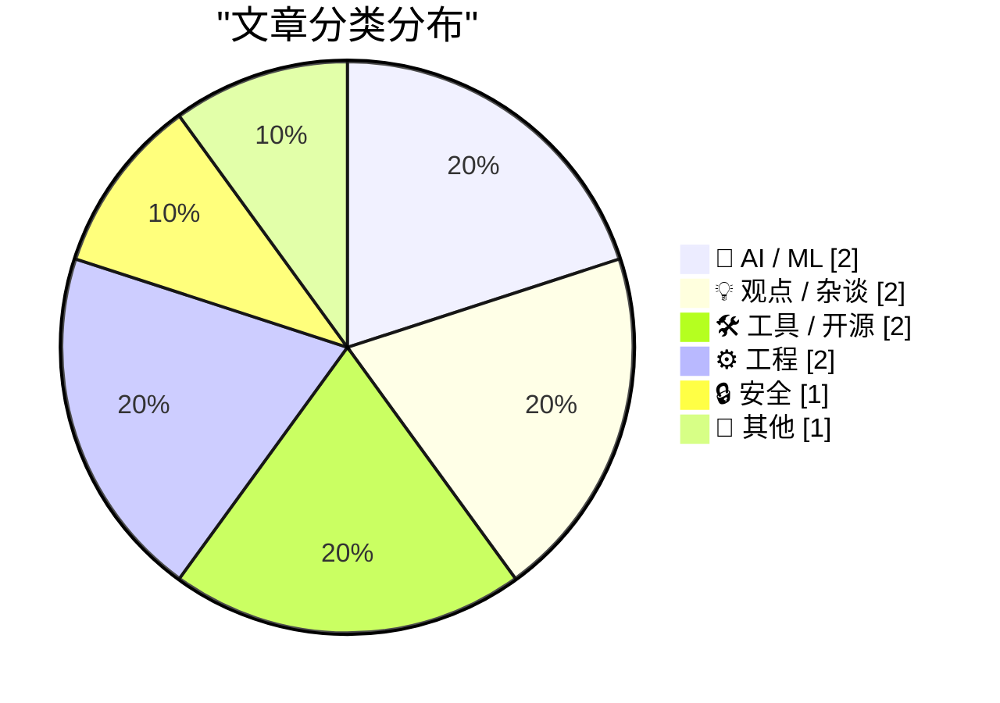
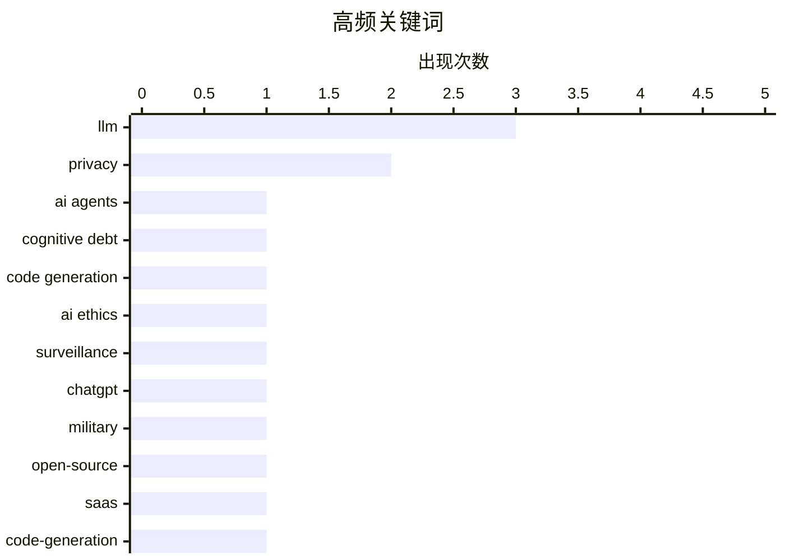

# 📰 AI 博客每日精选 — 2026-03-01

> 来自 Karpathy 推荐的 92 个顶级技术博客，AI 精选 Top 10

## 📝 今日看点

今日技术圈聚焦于AI应用的深化与伴随的治理挑战。一方面，AI智能体开发正从单纯生成代码转向追求可解释性与交互式协作，以应对“认知债务”问题。另一方面，AI技术军事化、数据隐私立法与开源生态可持续性等伦理与治理议题引发广泛担忧与讨论。同时，开发者工具正积极适配AI工作流，以提升工程效率与可控性。

---

## 🏆 今日必读

🥇 **交互式解释**

[Interactive explanations](https://simonwillison.net/guides/agentic-engineering-patterns/interactive-explanations/#atom-everything) — simonwillison.net · 14 小时前 · 🤖 AI / ML

> 文章讨论了智能体工程中因不理解AI生成代码而产生的“认知债务”问题。作者提出“交互式解释”模式作为解决方案，即让AI智能体在生成代码后，能够以对话形式解释其工作原理和关键决策。这种模式旨在将代码从“黑盒”转变为可理解、可审计的资产，从而降低维护风险。其核心观点是，通过强制AI解释自身输出，开发者能有效管理认知债务，确保对系统保持控制。

💡 **为什么值得读**: 为应对AI编码时代日益严重的“黑盒”代码问题，提供了一个具体、可落地的工程实践模式。

🏷️ AI agents, cognitive debt, code generation

🥈 **就这样，我要取消我的ChatGPT订阅**

[That's it, I'm cancelling my ChatGPT](https://idiallo.com/byte-size/im-cancelling-my-chatgpt-openai-account?src=feed) — idiallo.com · 19 小时前 · 💡 观点 / 杂谈

> 作者因OpenAI与美军合作而决定取消ChatGPT订阅。文章核心是批评Sam Altman宣布ChatGPT将用于美国国防部机密网络，认为这是大规模监控和武器化AI的“助推器”。作者指出，现有基础设施已为大规模监控做好准备，而此次合作是关键的“赋能”步骤。其结论是，这项合作越过了道德红线，促使个人用户必须用行动（取消订阅）来表达反对。

💡 **为什么值得读**: 提供了一个普通用户对AI公司军事化合作的直接反应与伦理思考，揭示了技术普及背后的政治与道德争议。

🏷️ AI ethics, surveillance, ChatGPT, military

🥉 **开源、SaaS与无限代码生成后的沉寂**

[Open Source, SaaS, and the Silence After Unlimited Code Generation](https://worksonmymachine.ai/p/open-source-saas-and-the-silence) — worksonmymachine.substack.com · 22 小时前 · 💡 观点 / 杂谈

> 文章探讨了AI无限生成代码能力对开源软件和SaaS商业模式的潜在冲击。核心论点是，AI降低了代码编写门槛，可能导致开源贡献质量下降和“反馈的终结”，因为用户不再需要深入理解或调试代码。同时，SaaS公司可能面临产品同质化加剧的挑战。作者认为，真正的价值将从“生成代码”转向更深层的理解、设计和维护能力。

💡 **为什么值得读**: 前瞻性地分析了AI代码生成普及后，软件开发生态可能发生的根本性转变，对开发者和企业具有战略警示意义。

🏷️ open-source, SaaS, LLM, code-generation

---

## 📊 数据概览

| 扫描源 | 抓取文章 | 时间范围 | 精选 |
|:---:|:---:|:---:|:---:|
| 84/92 | 2413 篇 → 15 篇 | 24h | **10 篇** |

### 分类分布



### 高频关键词



<details>
<summary>📈 纯文本关键词图（终端友好）</summary>

```
llm             │ ████████████████████ 3
privacy         │ █████████████░░░░░░░ 2
ai agents       │ ███████░░░░░░░░░░░░░ 1
cognitive debt  │ ███████░░░░░░░░░░░░░ 1
code generation │ ███████░░░░░░░░░░░░░ 1
ai ethics       │ ███████░░░░░░░░░░░░░ 1
surveillance    │ ███████░░░░░░░░░░░░░ 1
chatgpt         │ ███████░░░░░░░░░░░░░ 1
military        │ ███████░░░░░░░░░░░░░ 1
open-source     │ ███████░░░░░░░░░░░░░ 1
```

</details>

### 🏷️ 话题标签

**llm**(3) · **privacy**(2) · **ai agents**(1) · cognitive debt(1) · code generation(1) · ai ethics(1) · surveillance(1) · chatgpt(1) · military(1) · open-source(1) · saas(1) · code-generation(1) · redis(1) · documentation(1) · patterns(1) · ai(1) · data export(1) · claude(1) · regulation(1) · operating systems(1)

---

## 🤖 AI / ML

### 1. 交互式解释

[Interactive explanations](https://simonwillison.net/guides/agentic-engineering-patterns/interactive-explanations/#atom-everything) — **simonwillison.net** · 14 小时前 · ⭐ 25/30

> 文章讨论了智能体工程中因不理解AI生成代码而产生的“认知债务”问题。作者提出“交互式解释”模式作为解决方案，即让AI智能体在生成代码后，能够以对话形式解释其工作原理和关键决策。这种模式旨在将代码从“黑盒”转变为可理解、可审计的资产，从而降低维护风险。其核心观点是，通过强制AI解释自身输出，开发者能有效管理认知债务，确保对系统保持控制。

🏷️ AI agents, cognitive debt, code generation

---

### 2. Python源代码中的LLM使用痕迹

[LLM Use in the Python Source Code](https://blog.miguelgrinberg.com/post/llm-use-in-the-python-source-code) — **miguelgrinberg.com** · 22 小时前 · ⭐ 21/30

> 文章揭示了一个在社交媒体流传的技巧：在GitHub上屏蔽claude用户后，访问任何包含该用户提交的仓库时，顶部都会出现提示横幅。作者利用此方法发现，Python语言的官方实现CPython仓库中也出现了Claude的提交记录。这表明像Python这样的核心开源项目已开始使用Claude Code等AI编码助手。这一发现引发了关于AI生成代码进入核心基础设施的质量与审计问题的讨论。

🏷️ LLM, GitHub, code-review, automation

---

## 💡 观点 / 杂谈

### 3. 就这样，我要取消我的ChatGPT订阅

[That's it, I'm cancelling my ChatGPT](https://idiallo.com/byte-size/im-cancelling-my-chatgpt-openai-account?src=feed) — **idiallo.com** · 19 小时前 · ⭐ 24/30

> 作者因OpenAI与美军合作而决定取消ChatGPT订阅。文章核心是批评Sam Altman宣布ChatGPT将用于美国国防部机密网络，认为这是大规模监控和武器化AI的“助推器”。作者指出，现有基础设施已为大规模监控做好准备，而此次合作是关键的“赋能”步骤。其结论是，这项合作越过了道德红线，促使个人用户必须用行动（取消订阅）来表达反对。

🏷️ AI ethics, surveillance, ChatGPT, military

---

### 4. 开源、SaaS与无限代码生成后的沉寂

[Open Source, SaaS, and the Silence After Unlimited Code Generation](https://worksonmymachine.ai/p/open-source-saas-and-the-silence) — **worksonmymachine.substack.com** · 22 小时前 · ⭐ 24/30

> 文章探讨了AI无限生成代码能力对开源软件和SaaS商业模式的潜在冲击。核心论点是，AI降低了代码编写门槛，可能导致开源贡献质量下降和“反馈的终结”，因为用户不再需要深入理解或调试代码。同时，SaaS公司可能面临产品同质化加剧的挑战。作者认为，真正的价值将从“生成代码”转向更深层的理解、设计和维护能力。

🏷️ open-source, SaaS, LLM, code-generation

---

## 🛠 工具 / 开源

### 5. Redis编码模式

[Redis patterns for coding](http://antirez.com/news/161) — **antirez.com** · 3 小时前 · ⭐ 23/30

> Redis创始人antirez发布了一份面向LLM和编码智能体的Redis专用文档。该文档系统性地提供了Redis命令、数据类型的详尽说明，以及常用的使用模式、配置提示和基于Redis命令构建的算法示例。作者幽默地指出，这份文档对人类开发者同样有用。其目的是确保搜索引擎能索引该资源，使其成为AI和人类开发者共用的权威参考。

🏷️ Redis, documentation, LLM, patterns

---

### 6. 引用claude.com/import-memory

[Quoting claude.com/import-memory](https://simonwillison.net/2026/Mar/1/claude-import-memory/#atom-everything) — **simonwillison.net** · 1 小时前 · ⭐ 22/30

> 文章展示了如何向Claude AI请求导出其存储的所有关于用户的“记忆”数据。通过一段具体的提示词，用户可以要求AI列出所有存储的记忆、从过往对话中学到的上下文，并以特定格式（如代码块）输出。这涉及AI对个人数据的记忆、存储和可移植性问题。Simon Willison记录此提示词，为用户管理自身AI数据提供了可操作的方法。

🏷️ AI, data export, privacy, Claude

---

## ⚙️ 工程

### 7. 下游测试

[Downstream Testing](https://nesbitt.io/2026/03/01/downstream-testing.html) — **nesbitt.io** · 13 小时前 · ⭐ 22/30

> 文章指出了一个开源库维护中的普遍痛点：库维护者在发布新版本前，通常无法对其下游依赖项目进行充分测试。这导致库的变更可能意外破坏大量使用它的应用程序，而维护者往往在用户反馈后才知晓问题。核心问题是缺乏有效的“下游测试”机制来预防此类破坏性变更。结论是，这构成了开源软件供应链中的一个关键风险点。

🏷️ testing, libraries, dependencies, software maintenance

---

### 8. 在Bash脚本中处理文件扩展名

[Working with file extensions in bash scripts](https://www.johndcook.com/blog/2026/02/28/file-extensions-bash/) — **johndcook.com** · 18 小时前 · ⭐ 21/30

> 文章分享了在Bash脚本中处理文件扩展名的简洁技巧。作者承认自己更偏爱Python等通用语言，但指出Shell脚本有时能以极其简洁的方式解决特定问题。文中通过具体示例，展示了如何利用Bash的参数扩展功能（如`${file##*.}`和`${file%.*}`）来提取扩展名和文件名。其核心观点是，这些看似隐晦的语法正是为解决常见问题而设计的精炼方案。

🏷️ bash, shell scripting, file operations

---

## 🔒 安全

### 9. “你多大了？”操作系统问道

[&ldquo;How old are you?&rdquo; Asked the OS](https://idiallo.com/byte-size/how-old-are-you-asked-the-os?src=feed) — **idiallo.com** · 11 小时前 · ⭐ 22/30

> 文章分析了加州于2025年10月通过的新法律AB-1043，该法要求操作系统在创建账户时收集用户年龄。作者质疑该法的可执行性，例如对离线系统（如家庭Raspberry Pi）、提供错误年龄或儿童使用设备等情况如何监管。核心论点是，该法无法真正被执行，但其目的可能并非强制执法，而是确立一种“年龄收集”的规范，为后续监管铺路。

🏷️ privacy, regulation, operating systems, age verification

---

## 📝 其他

### 10. 阅读清单 02/28/26

[Reading List 02/28/26](https://www.construction-physics.com/p/reading-list-022826) — **construction-physics.com** · 23 小时前 · ⭐ 19/30

> 这是一份来自“建造物理学”博客的多元化阅读推荐清单。内容涵盖多个领域：洛杉矶的建筑许可成本、涓滴住房效应、松下停止制造电视机、机器人出租车的远程操作员现状，以及地热能技术的进展。清单以简短的关键词形式呈现每个主题的核心看点。其目的是为读者提供跨领域的、高质量的深度阅读素材。

🏷️ urban-tech, robotics, geothermal

---

*生成于 2026-03-01 13:17 | 扫描 84 源 → 获取 2413 篇 → 精选 10 篇*
*基于 [Hacker News Popularity Contest 2025](https://refactoringenglish.com/tools/hn-popularity/) RSS 源列表，由 [Andrej Karpathy](https://x.com/karpathy) 推荐*
*由「懂点儿AI」制作，欢迎关注同名微信公众号获取更多 AI 实用技巧 💡*
