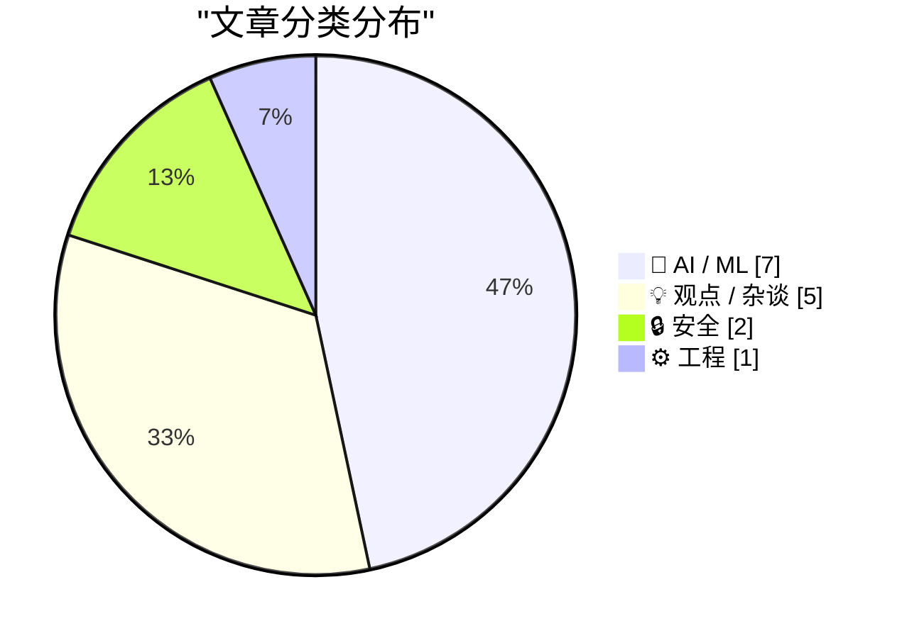
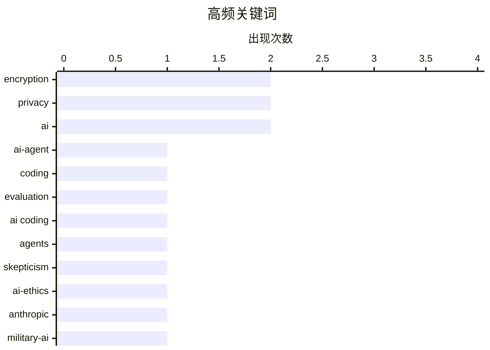

# 📰 AI 博客每日精选 — 2026-03-01

> 来自 Karpathy 推荐的 92 个顶级技术博客，AI 精选 Top 15

## 📝 今日看点

今日技术圈聚焦于AI伦理与安全两大核心议题。一方面，AI编码代理的能力进化正引发开发者从怀疑转向实践，其生产力的提升成为行业热点；另一方面，Anthropic与OpenAI等巨头因涉及国防合作与巨额融资，陷入巨大的伦理争议与商业合理性拷问。与此同时，网络安全领域警报频传，从个人数据加密的常见误区到国家级僵尸网络的威胁，凸显出安全实践与防御的紧迫性。

---

## 🏆 今日必读

🥇 **一位AI编码代理怀疑论者的详尽实践**

[An AI agent coding skeptic tries AI agent coding, in excessive detail](https://minimaxir.com/2026/02/ai-agent-coding/) — minimaxir.com · 1 天前 · 🤖 AI / ML

> 文章记录了作者从怀疑到实践AI编码代理的完整过程。作者通过一系列难度递增的项目进行测试，从简单的YouTube元数据抓取工具开始，最终挑战了更复杂的应用。实践表明，自2023年11月以来，AI编码代理的能力取得了显著进步，能够处理相当复杂的开发任务。作者的核心结论是，尽管存在局限性，但AI编码代理已成为一个强大且实用的工具，值得开发者将其纳入工作流。

💡 **为什么值得读**: 通过真实、渐进的项目案例，为开发者评估AI编码代理的实际能力提供了极具参考价值的一手经验。

🏷️ AI-agent, coding, evaluation

🥈 **一位AI编码代理怀疑论者的详尽实践**

[An AI agent coding skeptic tries AI agent coding, in excessive detail](https://simonwillison.net/2026/Feb/27/ai-agent-coding-in-excessive-detail/#atom-everything) — simonwillison.net · 1 天前 · 🤖 AI / ML

> Simon Willison推荐了Max Woolf关于AI编码代理实践的文章。文章属于“编码代理在去年11月变强了”这一类型，作者通过一系列野心越来越大的项目进行验证。这些项目从简单的YouTube元数据抓取器开始，最终演进到更复杂的应用。Willison认为这篇文章非常值得花费时间阅读。

💡 **为什么值得读**: 这是一篇被资深技术专家高度评价的实践报告，对于想了解AI编码代理当前能力边界的人来说是必读材料。

🏷️ AI coding, agents, skepticism

🥉 **给达里奥一块饼干？——Anthropic与死亡交易**

[A Cookie for Dario? — Anthropic and selling death](https://anildash.com/2026/02/27/a-cookie-for-dario/) — anildash.com · 1 天前 · 🤖 AI / ML

> 文章围绕Anthropic公司拒绝美国国防部修改其Claude平台以支持潜在战争罪行的请求展开。尽管国防部将请求包装为“合法目的”，但其近期行为已表明其对“合法”的定义存在争议。Anthropic CEO Dario Amodei的公开拒绝，引发了对科技公司伦理责任与政府权力边界的大讨论。作者的核心观点是，Anthropic的立场是对科技伦理底线的一次重要捍卫。

💡 **为什么值得读**: 它尖锐地揭示了AI巨头在军事化应用上面临的伦理抉择与政治压力，关乎技术发展的根本方向。

🏷️ AI-ethics, Anthropic, military-AI

---

## 📊 数据概览

| 扫描源 | 抓取文章 | 时间范围 | 精选 |
|:---:|:---:|:---:|:---:|
| 86/92 | 2433 篇 → 42 篇 | 48h | **15 篇** |

### 分类分布



### 高频关键词



<details>
<summary>📈 纯文本关键词图（终端友好）</summary>

```
encryption │ ████████████████████ 2
privacy    │ ████████████████████ 2
ai         │ ████████████████████ 2
ai-agent   │ ██████████░░░░░░░░░░ 1
coding     │ ██████████░░░░░░░░░░ 1
evaluation │ ██████████░░░░░░░░░░ 1
ai coding  │ ██████████░░░░░░░░░░ 1
agents     │ ██████████░░░░░░░░░░ 1
skepticism │ ██████████░░░░░░░░░░ 1
ai-ethics  │ ██████████░░░░░░░░░░ 1
```

</details>

### 🏷️ 话题标签

**encryption**(2) · **privacy**(2) · **ai**(2) · ai-agent(1) · coding(1) · evaluation(1) · ai coding(1) · agents(1) · skepticism(1) · ai-ethics(1) · anthropic(1) · military-ai(1) · passkeys(1) · data loss(1) · botnet(1) · vulnerability(1) · cybersecurity(1) · openai(1) · financing(1) · valuation(1)

---

## 🤖 AI / ML

### 1. 一位AI编码代理怀疑论者的详尽实践

[An AI agent coding skeptic tries AI agent coding, in excessive detail](https://minimaxir.com/2026/02/ai-agent-coding/) — **minimaxir.com** · 1 天前 · ⭐ 28/30

> 文章记录了作者从怀疑到实践AI编码代理的完整过程。作者通过一系列难度递增的项目进行测试，从简单的YouTube元数据抓取工具开始，最终挑战了更复杂的应用。实践表明，自2023年11月以来，AI编码代理的能力取得了显著进步，能够处理相当复杂的开发任务。作者的核心结论是，尽管存在局限性，但AI编码代理已成为一个强大且实用的工具，值得开发者将其纳入工作流。

🏷️ AI-agent, coding, evaluation

---

### 2. 一位AI编码代理怀疑论者的详尽实践

[An AI agent coding skeptic tries AI agent coding, in excessive detail](https://simonwillison.net/2026/Feb/27/ai-agent-coding-in-excessive-detail/#atom-everything) — **simonwillison.net** · 1 天前 · ⭐ 27/30

> Simon Willison推荐了Max Woolf关于AI编码代理实践的文章。文章属于“编码代理在去年11月变强了”这一类型，作者通过一系列野心越来越大的项目进行验证。这些项目从简单的YouTube元数据抓取器开始，最终演进到更复杂的应用。Willison认为这篇文章非常值得花费时间阅读。

🏷️ AI coding, agents, skepticism

---

### 3. 给达里奥一块饼干？——Anthropic与死亡交易

[A Cookie for Dario? — Anthropic and selling death](https://anildash.com/2026/02/27/a-cookie-for-dario/) — **anildash.com** · 1 天前 · ⭐ 26/30

> 文章围绕Anthropic公司拒绝美国国防部修改其Claude平台以支持潜在战争罪行的请求展开。尽管国防部将请求包装为“合法目的”，但其近期行为已表明其对“合法”的定义存在争议。Anthropic CEO Dario Amodei的公开拒绝，引发了对科技公司伦理责任与政府权力边界的大讨论。作者的核心观点是，Anthropic的立场是对科技伦理底线的一次重要捍卫。

🏷️ AI-ethics, Anthropic, military-AI

---

### 4. OpenAI的新融资合理吗？

[Does OpenAI’s new financing make sense?](https://garymarcus.substack.com/p/does-openais-new-financing-make-sense) — **garymarcus.substack.com** · 1 天前 · ⭐ 25/30

> 文章对OpenAI新一轮融资的合理性提出根本性质疑。作者Gary Marcus并非唯一持此怀疑态度的人，他认为这笔巨额融资背后的商业逻辑和估值基础可能存在问题。核心观点是，市场对OpenAI的狂热投资可能缺乏坚实的技术与商业基本面支撑。

🏷️ OpenAI, financing, valuation

---

### 5. 交互式解释

[Interactive explanations](https://simonwillison.net/guides/agentic-engineering-patterns/interactive-explanations/#atom-everything) — **simonwillison.net** · 14 小时前 · ⭐ 24/30

> 这是《智能体工程模式》系列中的一个模式，旨在解决AI编写代码导致的“认知债务”问题。当开发者不理解智能体生成的代码如何工作时，就会积累这种债务。文章提出，对于复杂逻辑，需要通过交互式解释（如让智能体逐步讲解、可视化流程）来重建理解。该模式的核心是确保人类始终能掌控和审查自动化生成的解决方案。

🏷️ AI agents, software engineering, cognitive debt

---

### 6. 就这样，我要取消我的ChatGPT订阅

[That's it, I'm cancelling my ChatGPT](https://idiallo.com/byte-size/im-cancelling-my-chatgpt-openai-account?src=feed) — **idiallo.com** · 19 小时前 · ⭐ 24/30

> 作者因Sam Altman宣布ChatGPT将接入美国国防部机密网络而决定取消订阅。他认为这是大规模监控和将技术用于武器部署的入口点，是现有监控基础设施所需的“赋能者”。此举与Anthropic CEO公开拒绝与国防部合作形成鲜明对比。作者的核心行动是退出支持，以抗议OpenAI的军事化转向。

🏷️ ChatGPT, ethics, surveillance

---

### 7. 引用claude.com/import-memory

[Quoting claude.com/import-memory](https://simonwillison.net/2026/Mar/1/claude-import-memory/#atom-everything) — **simonwillison.net** · 1 小时前 · ⭐ 22/30

> Simon Willison记录了一段向Claude AI请求导出全部记忆数据的提示词。该提示词要求Claude列出所有关于用户的记忆和从过往对话中学到的上下文，并以特定格式（日期-内容）输出在一个代码块中，确保覆盖所有指令、偏好和个人信息。这展示了用户如何尝试从AI对话服务中提取和迁移自己的数据。引文本身是一个完整、可操作的数据导出指令模板。

🏷️ AI, data export, privacy

---

## 💡 观点 / 杂谈

### 8. 西弗吉尼亚州的反苹果CSAM诉讼将帮助儿童性犯罪者逍遥法外

[West Virginia’s Anti-Apple CSAM Lawsuit Would Help Child Predators Walk Free](https://www.techdirt.com/2026/02/25/west-virginias-anti-apple-csam-lawsuit-would-help-child-predators-walk-free/) — **daringfireball.net** · 1 天前 · ⭐ 24/30

> 文章抨击了西弗吉尼亚州强制苹果扫描iCloud以查找儿童性虐待材料（CSAM）的诉讼。核心论点是，如果政府胜诉，强制扫描将成为无搜查令、无合理理由的政府搜查，所获证据将违反美国宪法第四修正案。根据“证据排除规则”，辩护律师可以要求法庭驳回这些证据，并很可能成功，最终导致定罪犯人因程序违法而被释放。作者认为这是一个非常容易论证的法律案例。

🏷️ encryption, privacy, legal

---

### 9. 整件事都是一场骗局

[The whole thing was a scam](https://garymarcus.substack.com/p/the-whole-thing-was-scam) — **garymarcus.substack.com** · 20 小时前 · ⭐ 24/30

> 文章以极其简短的断言指出，某件事情（从上下文推断可能与Anthropic CEO Dario Amodei面临的处境有关）从始至终都是一场预设好的骗局。作者认为“局早已设好，达里奥从未有过机会”，暗示整个过程存在不公与操纵。

🏷️ AI, governance, scandal

---

### 10. 开源、SaaS与无限代码生成后的沉默

[Open Source, SaaS, and the Silence After Unlimited Code Generation](https://worksonmymachine.ai/p/open-source-saas-and-the-silence) — **worksonmymachine.substack.com** · 22 小时前 · ⭐ 24/30

> 文章探讨了AI代码生成工具普及后，开源社区和SaaS商业模式面临的反馈机制危机。核心论点是，当开发者能通过AI（如GitHub Copilot）无限生成代码时，他们不再需要搜索、复用和反馈现有开源项目，导致开源项目的使用数据、问题报告和贡献大幅减少。这种“沉默”切断了开源项目赖以生存的社区互动与改进循环，可能使开源软件沦为静态的“训练数据化石”。作者认为，这最终会削弱软件创新的集体智慧根基，是比代码质量更深远的结构性威胁。

🏷️ open-source, SaaS, AI-code-generation

---

### 11. 为何苹果支持视频播客可能危及播客的最大优势

[Why Apple’s move to video could endanger podcasting's greatest power](https://anildash.com/2026/02/28/apple-video-podcast-power/) — **anildash.com** · 1 天前 · ⭐ 24/30

> 文章批判了苹果在其播客应用中新增视频播客支持的决定，认为这破坏了播客生态的开放性。播客的成功根基在于其基于RSS的开放标准，这使得内容不受糟糕算法控制，也没有侵犯隐私的广告。苹果的新视频系统背离了这一标准，强制创作者将视频托管在少数几家选定公司（其基础设施已被私募股权收购）。结论是，这一变化将播客从开放、去中心化的媒体，推向受控于少数平台的封闭花园，从而剥夺了其抵抗监控资本主义和保持独立性的核心力量。

🏷️ podcast, open standard, Apple, platform control

---

### 12. 计算机与互联网：一把双刃剑

[Computers and the Internet: A Two-Edged Sword](https://blog.jim-nielsen.com/2026/two-edged-sword-of-computers-and-internet/) — **blog.jim-nielsen.com** · 1 天前 · ⭐ 23/30

> 文章呼应了Dave Rupert的观点，深入探讨了计算机和互联网对个人生活的矛盾影响。核心问题是，这些技术虽然承载了工作、爱好、教育和社区，但也可能对个人的专注力、心理健康和创造力产生负面影响。作者承认自己热爱互联网，但逐渐意识到其无孔不入的特性可能是一种损害，这种认知令人难以接受，因为技术与生活已深度绑定。结论是，我们需要正视技术这把“双刃剑”，在享受其便利的同时，警惕其对我们时间和心智的消耗。

🏷️ tech-critique, internet, productivity

---

## 🔒 安全

### 13. 求求你们，别再使用通行密钥来加密用户数据了

[Please, please, please stop using passkeys for encrypting user data](https://simonwillison.net/2026/Feb/27/passkeys/#atom-everything) — **simonwillison.net** · 1 天前 · ⭐ 25/30

> 文章核心是警告开发者不要使用通行密钥（Passkeys）加密用户数据。主要原因在于用户频繁丢失通行密钥，且可能意识不到数据因此被不可逆地加密并永久丢失。作者Tim Cappalli向整个身份认证行业发出恳求，呼吁停止推广这种用法。结论是，应让通行密钥专注于其作为身份验证器的核心职责，而非用于数据加密。

🏷️ passkeys, encryption, data loss

---

### 14. 谁是Kimwolf僵尸网络主控“Dort”？

[Who is the Kimwolf Botmaster “Dort”?](https://krebsonsecurity.com/2026/02/who-is-the-kimwolf-botmaster-dort/) — **krebsonsecurity.com** · 1 天前 · ⭐ 25/30

> 文章深入调查了全球最大、最具破坏性的僵尸网络Kimwolf背后的控制者“Dort”。自漏洞被披露及Kimwolf被曝光以来，“Dort”对安全研究员和本文作者发起了一系列DDoS攻击、人肉搜索和邮件轰炸。近期更是策划了一起针对研究员家庭的SWATting事件（假报警引出特警队）。本文旨在追踪并揭示“Dort”的真实身份。

🏷️ botnet, vulnerability, cybersecurity

---

## ⚙️ 工程

### 15. Redis编码模式

[Redis patterns for coding](http://antirez.com/news/161) — **antirez.com** · 3 小时前 · ⭐ 23/30

> Redis创始人antirez发布了一份面向编码（特别是AI智能体）的Redis综合指南。该文档详尽涵盖了Redis命令、数据类型、常用使用模式、配置提示以及如何组合命令来实现特定算法。其核心目的是为LLM和编码代理提供结构化知识，以更好地生成或理解基于Redis的代码。文档也因其清晰实用而被开发者认为对人类同样极具价值。作者特意发布以确保搜索引擎能索引到这份资源。

🏷️ Redis, database, patterns

---

*生成于 2026-03-01 13:13 | 扫描 86 源 → 获取 2433 篇 → 精选 15 篇*
*基于 [Hacker News Popularity Contest 2025](https://refactoringenglish.com/tools/hn-popularity/) RSS 源列表，由 [Andrej Karpathy](https://x.com/karpathy) 推荐*
*由「懂点儿AI」制作，欢迎关注同名微信公众号获取更多 AI 实用技巧 💡*
